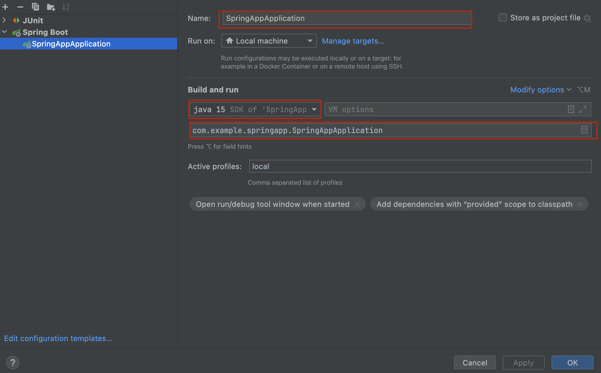

# Govtech Meteor

This project is build for the Take-Home Backend Technical Assessment for TAP 2023.

---
## Getting Started

### Prerequisites
- Homebrew (Optional but recommended for easier installation of MySQL, Java and Maven)
- Apache Maven 3.8.6
- [Java 15](https://www.techspot.com/downloads/5552-java-15-jdk.html)
- MySQL
- Postman (Optional)
- [Intellij IDEA](https://www.jetbrains.com/idea/download)

### Setup
- Clone this repository into a local directory

        git clone https://github.com/Door-oof/TAP-2023-Meteor.git

- Open the project in Intellij and reload Maven dependencies in `pom.xml` if project does not auto-configure
- Change the MySQL password and username in `src/main/resources/application.properties` to match your own
- Run the sql code `schema.sql` located in `src/main/resources/application.properties`

Option 1: Run the application through jar file

    mvn clean install

- The resulting JAR is: `./target/SpringApp-0.0.1-SNAPSHOT.jar`
- Run `java -jar SpringApp-0.0.1-SNAPSHOT.jar`

Option 2: Run the application through Intellij
- In Intellij, navigate to `Run` and click `Edit Configurations`
- Click "+" button for new Debug configuration and choose `Spring Boot`
- Details for configuration as seen in picture below

- After finishing configuration, click "Apply" then "OK" at the end
- Verify the configuration. When you click the run or debug button you should see no error in the terminal

## Usage
- Once the application is running navigate to `http://localhost:8080/swagger-ui.html#/` in the browser to view all API endpoints.
- Refer to `ApiEndpoints.docx` in `docs` folder for brief explanation of the endpoints and some examples to call the API endpoints, especially when using Postman
- Refer to `Schema.png` in `docs/images` folder for the database diagram

## Notes
- Gender is assumed to only be either M (male), F (female) or NotSpecified (Not Specified)
- Marital Status is assumed to only be either Married, Single, Divorced, Widowed or NA (Not Applicable)
- Housing Type is assumed to only be either Landed, HDB or Condominium
- Occupation Type/Status is assumed to only be either Unemployed, Student, Employed
- A year is assumed to have 365 days. Therefore, the age calculated may not be very accurate
- Though the database diagram does not explicitly show the one to many mapping from `household` to `family_member`, it is implicitly enforced in the codebase, through `household_id` in the `household` table 
and `family_id` as the 'foreign key' in the `family_member` table that references to `household_id`
- Ensure that ports `8080` and `3306` are not in use as the application relies on these 2 ports

## License
[MIT](LICENSE)
